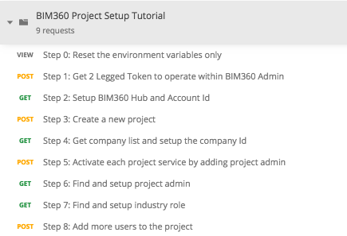
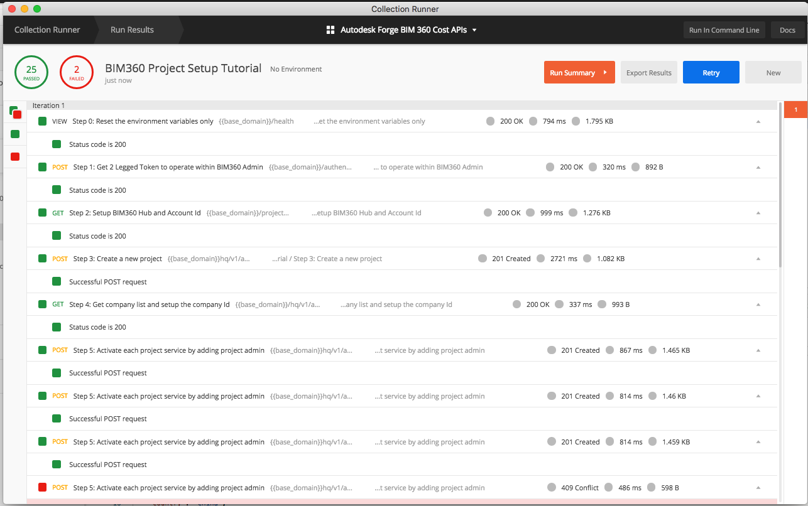

# BIM360 Project Setup Step-by-Step Tutorial

This folder contains a Postman Collection to setup BIM360 project, it provides the functionalities as follow:
1. Create a couple of BIM360 Projects from scratch or template project.
2. Activate Project services by adding project service admin.
3. Import users to document management and project administration module.

## Demonstration

## Preparation before you begin:
- [Create Forge App, get access to a BIM 360 Account](https://forge.autodesk.com/en/docs/bim360/v1/tutorials/getting-started/get-access-to-account/)

## Instructions to run the Postman tutorial are as below:

**Please watch the [Video](https://youtu.be/GdJO3dPNXdY) for the detail workflow, or follow the steps:**

### Pre-requisites
- Import Postman collection, create a fresh environment set,and change the following value in Step 0 & Step 3. 
    - in Step 0, Pre-request Script: 
        - (**Required**)Forge Client Key, please change to your Forge Client Id and Secret.
        - (**Required**)Admin email list, use comma to seperate mulitple admin emails, all the admin in the list will be added as project service admin for avialable service types.
        - (**Required**)User email list, use comma to seperate mulitple user emails, all the user in the list will be added to document_management and project_administration modules as admin.
        - (Optional)Base domain, should be always https://developer.api.autodesk.com/ by default.
        - (Optional)Service type list, use comma to seperate mulitple service types, all the service type in the list will be activated by adding project service admin.
        - (Optional)admin_index, user_index, service_index, these index will be kept to iterate the item in the corresponding list.

    - in Step 3, Pre-request Script:
        - (**Required**)Specify the project name that you want to create.

### Tutorials of BIM360 project setup workflow
- Step 0: Initiate the necessary environment variables before officially start the workflow.
- Step 1: Get 2 Legged Token to operate within BIM360 Admin.
- Step 2: Get and setup BIM360 Account Id.
- Step 3: Create a new project with specified project name.
- Step 4: Get company list and setup the company Id.
- Step 5: (Iterate)Activate each project service by adding project admin. **Iterate this step until all the listed project service are activated with all the listed admin**. 
- Step 6: Get and setup project admin.
- Step 7: Get and setup industry role.
- Step 8: (Iterate)Import more users to the project, again, **iterate to run this step until all the users in the list are added**.

Until now, you should have successfully created a project with all the avialable project services activated, and all the listed users are imported. But, the project members cannot access those services (UI/API) until the project service admins have manually clicked the activation link from the invitation emails, and logged in BIM360 once. Please refer to the [troubleshooting](https://knowledge.autodesk.com/support/bim-360/troubleshooting/caas/sfdcarticles/sfdcarticles/Users-not-receiving-invite-emails-to-BIM-360-Document-Management-projects.html) if the invitation email is not received.

## Further Reading
### Automate Workflow with Postman Collection Runner
**With the help of the Postman Collection Runner, you can actually automate the workflow, it helps you to quick verify your workflow with BIM 360 Project Setup process, or to do automation test to catch all the API issues|regresions**

**Please refer to the [Video](https://youtu.be/h_eFFf8f9UY) for how to use postman runner, and then follow the steps to run the collection:**

### Tutorials about workflow

- Import the Postman **Collection**.
- Setup the environment variables as mentioned before.
- Run Postman **Collection Runner**, select the collection.
- Click **Run BIM360 Proje...** button to start, you will see the result of the workflow.

**Note:** The collection will firstly automatically create a project, then activate the avialable project services for all the admins, after that, import all the users to the project as admin of document management and project administration.   

 # Tips & Tricks
- Currently, the following project services could be activated by BIM360 API:

    | Service Type | Description | 
    | :-----:| :----: | 
    | admin | BIM 360 Project Administration Service | 
    | doc_manager | BIM 360 Document Management Service | 
    | pm | BIM 360 Project Management Service | 
    | fng | BIM 360 Field Management Service |
    | collab | BIM 360 Design Collaboration Service | 
    | cost | BIM 360 Cost Management Service | 
    | gng | BIM 360 Model Coordination Service | 
    | plan | BIM 360 Plan Classic Service | 
    | field | BIM 360 Field Classic Service | 
    | glue | BIM 360 Glue Classic Service | 

## License
This sample is licensed under the terms of the [MIT License](http://opensource.org/licenses/MIT). Please see the [LICENSE](LICENSE) file for full details.

## Written by
Zhong Wu [@johnonsoftware](https://twitter.com/johnonsoftware), [Forge Partner Development](http://forge.autodesk.com)
